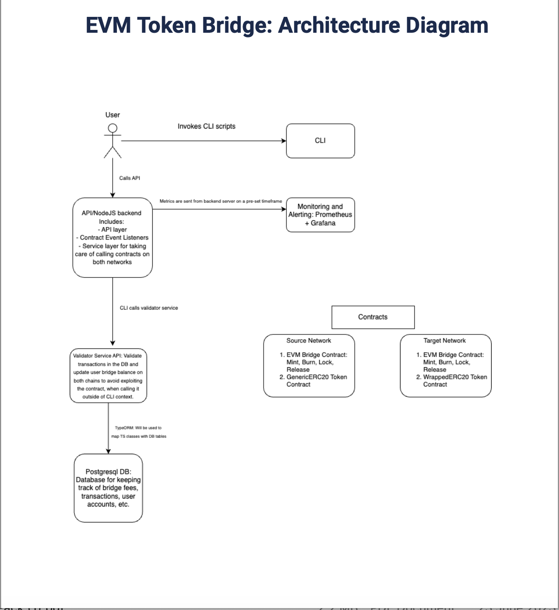

# LimeAcademy-Final-Project 

 

# Getting started

You can either run the project with the already deployed contracts or deploy new ones by running: bin/deploy.sh

# Configuration Requirements 

- NodeJS >= 19.0
- Docker environment and CLI - installed locally for running the PSQL docker image

# Running the project

The project has been tested by using Sepolia as a source network and Goerli as the target network. 
You can change those networks by providing different values in the config files.

- Provide values in secrets.json 
- Provide values in scripts/validator-service/config/config.json
- Run bin/boot-local-system.sh script in order to spin up the PSQL container, the express server and indexer all at once.
- If you want to run them separately, so you can see the console logs: npx ts-node {main-file-name.ts} the validator and 
  event-listener directories.

# Contract Deployment and New Token Creation 

- In case you want to deploy the contracts once again: run the bin/deploy.sh script
- If you want to create new tokens on both network and mint an initial amount to a user address, 
  use the scripts/custom-tasks/createERCTokens.ts
- IMPORTANT: For simpler binding of the Generic and Wrapped token pairs in BE, the naming of the tokenSymbols must be as 
  the following examples: GTT -> WTT or GFT -> WFT. Run npx ts-node createERCTokens.ts to deploy a new generic and wrapped
  tokens on both networks.
  
# CLI

The CLI supports 6 operations:

- npm run-script interact login
- npm run-script interact lock {SIWE_NONCE} {GENERIC_TOKEN_SYMBOL} {TOKEN_ADDRESS} {AMOUNT_IN_WEI}
- npm run-script interact claim {SIWE_NONCE} {WRAPPED_TOKEN_SYMBOL} {WRAPPED_TOKEN_ADDRESS} {AMOUNT_IN_WEI}
- npm run-script interact burn {SIWE_NONCE} {WRAPPED_TOKEN_SYMBOL} {WRAPPED_TOKEN_SYMBOL} {AMOUNT_IN_WEI} 
- npm run-script interact release {SIWE_NONCE} {GENERIC_TOKEN_SYMBOL} {TOKEN_ADDRESS} {AMOUNT_IN_WEI}
- npm run-script interact logout {SIWE_NONCE}

# Validator Service API

The API supports the following endpoints. The transaction validation endpoints are not listed.

- POST: http://localhost:{VALIDATOR_PORT}/api/fetch-bridged-by-user  
  Example JSON request body:
  { 
   "user": "0x1F4e2783a1d87C1aCCA77E081396B9305A96A4C0"
  }
- GET: http://localhost:{VALIDATOR_PORT}/api/fetch-burnt-awaiting
- GET: http://localhost:{VALIDATOR_PORT}/api/fetch-locked-awaiting
- GET: http://localhost:{VALIDATOR_PORT}/api/fetch-all-bridged

CLI authentication endpoints:

- GET: http://localhost:{VALIDATOR_PORT}/nonce
- POST: http://localhost:{VALIDATOR_PORT}/isAuthenticated
- GET: http://localhost:{VALIDATOR_PORT}/getData
- POST: http://localhost:{VALIDATOR_PORT}/verify
- POST: http://localhost:{VALIDATOR_PORT}/logout 

IMPORTANT: The API authenticated will work only, when the CLI is used. A small change must be made to enable it 
to work for external calls, however, the project deadline was way too close to implement it. 